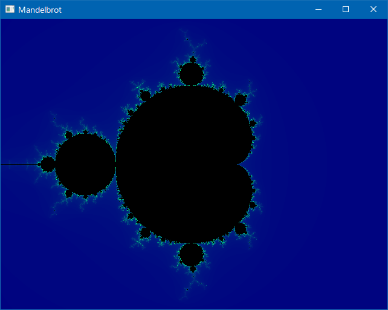
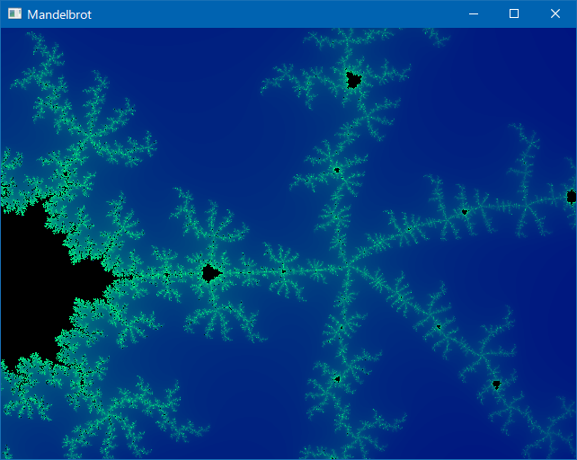

# Mandelbrot

Self-study program for drawing the Mandelbrot set.

This code based on the "[pixels](https://github.com/parasyte/pixels)" sample code.




## Run

```
cargo run --release
```


## Operation

* Mouse left double click : set the double-clicked point to the center
* Mouse dragging (with holding down the left button : move the center to the drag direction
* Mouse wheel : zoom in/out
* Space key : reset the center position and the zoom scale
* Escape key : quit

## History

June 23, 2021: Improve performance  
June 22, 2021: 1st Releaes
